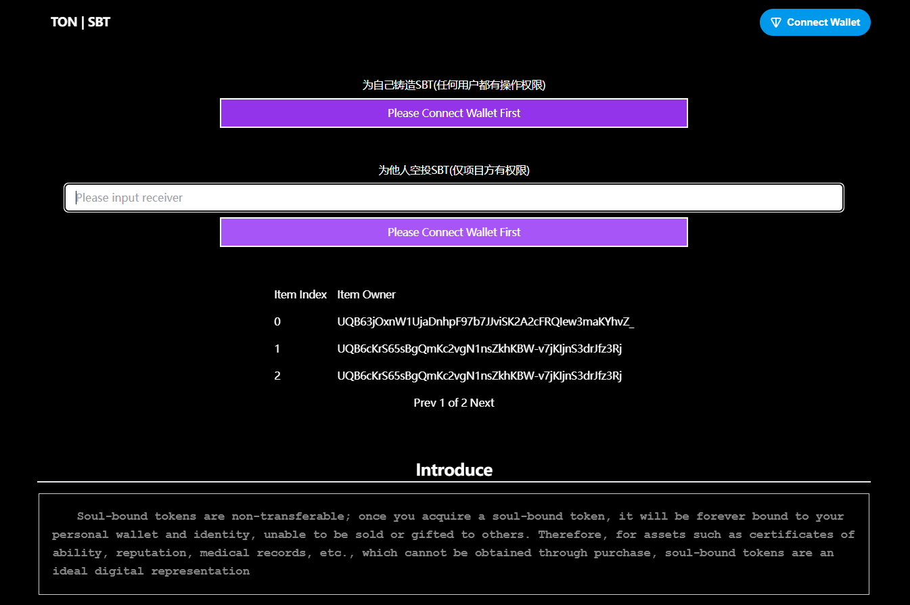

# 0xFar777-SBT

## Descript

## ENV

```
node === 20
```

## Getting Started

```
yarn 
```

### First, run the development server:

```bash
yarn dev

```

Open [http://localhost:3000](http://localhost:3000) with your browser to see the result.

### Second, build the project:

```bash
yarn build
```

## Deploy

## screenshot

